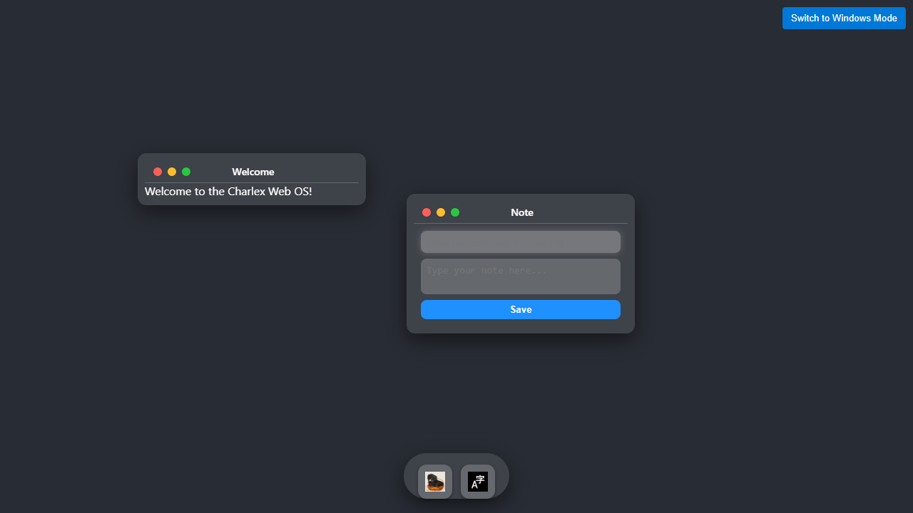
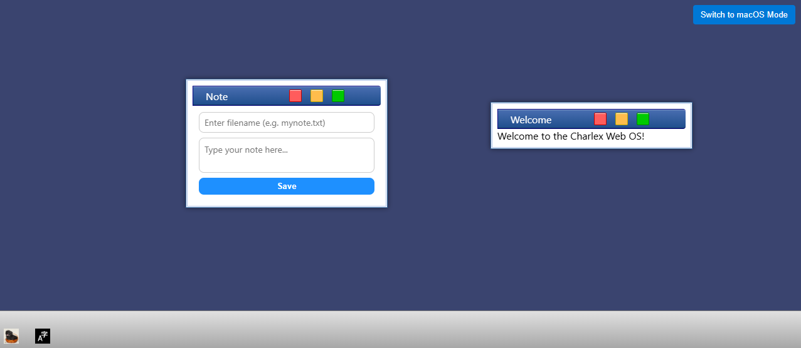

# Charlex Web OS

This project is a frontend web application that acts like a real operating system based on the web.

## Requirements

- A modern Chrome browser is all you need to experience the magic.
- No extra dependencies or installations are required.

## How to Use

1. Open `index.html` in your Chrome browser.
2. Interact with the windows, dock icons, and note-taking features as if you were using a real OS.
3. Enjoy the smooth and responsive UI powered by JavaScript and CSS.

## Features

- Draggable and resizable windows.
- Dock with interactive icons.
- Note window with save and download functionality.
- Stylish and modern UI with blurred backgrounds and smooth animations.

## Development

- All JavaScript files are located in the `js/` directory.
- CSS styles are separated into the `css/style.css` file.
- The app runs entirely in the browser without any backend dependencies.

## License

This project is licensed under the MIT License.

Copyright (c) 2024 Pyshwaa

### screenshot

